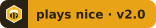
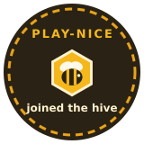
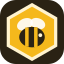

# The Play-Nice bee

> **Status:** Current · the badge and sticker, with the lines to copy.

A bee in a honeycomb cell: this project is part of the hive. The badge is
drawn by `playnice check` from the project's own check, and links to it, so a
copied picture proves nothing on its own.

## The badge, in its three states

| State | Badge | When |
|---|---|---|
| Plays nice |  | the project follows the current version and every check passed |
| Behind |  | a newer Play-Nice is out; run `playnice upgrade` (or bump the pin) |
| Fix needed |  | a check failed; the check's log says what to fix |

The state is always written on the badge, never shown by colour alone, and
every colour pair meets WCAG AA contrast (7.2, 5.5 and 5.2 to 1).

## Show it

`playnice start` adds this line under your README's title and writes
`playnice-badge.svg`; your CI (or `playnice check --badge
playnice-badge.svg`) keeps it current:

```markdown
[](https://github.com/Rylee-Bee/play-nice-contracts)
```

## The sticker



For a README, a site footer, or a laptop. It says you joined; it isn't a
check result, so pair it with the badge if you want proof.

```markdown

```

## The bee on its own



Use it next to the name "Play-Nice". Rules for the name and the bee:
[TRADEMARKS.md](../../TRADEMARKS.md).
